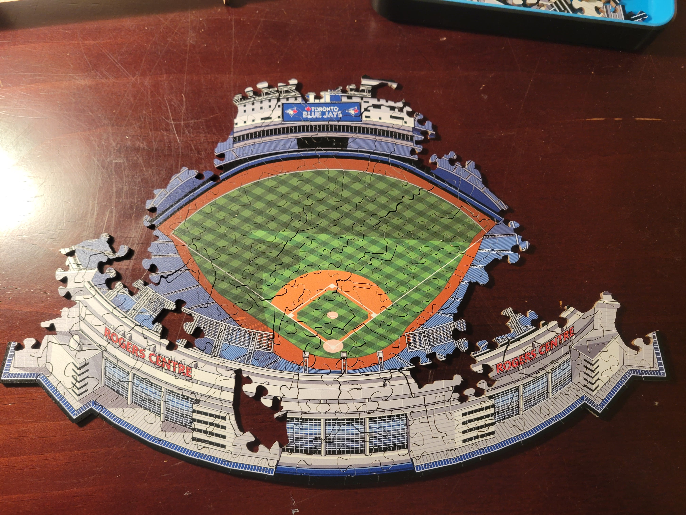

I got this puzzle at Christmas from my sister-in-law (who has gifted me several puzzles and related projects over the years). It's a small puzzle with uniquely-shaped pieces. Some of them are in the shape of baseball players in different action poses. The pieces are made of wood, instead of the standard cardboard, and unfortunately do not lock into place which made assembling this difficult. 

### Progress 

**Started**: February 8 2026 \
**Number of sessions**: 4) \
**Completed**: March 7 2026

### Pictures

*Completed puzzle photos (March 7 2026)*

*Progress picture (March 7 2026)*

*Progress as of (March 2, 2026)*

