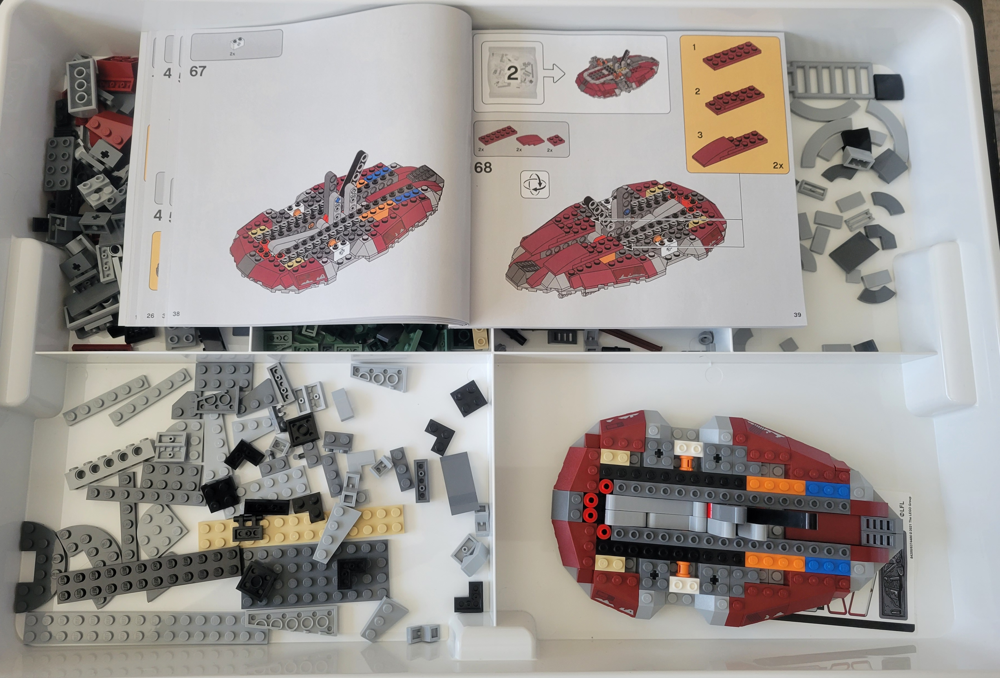
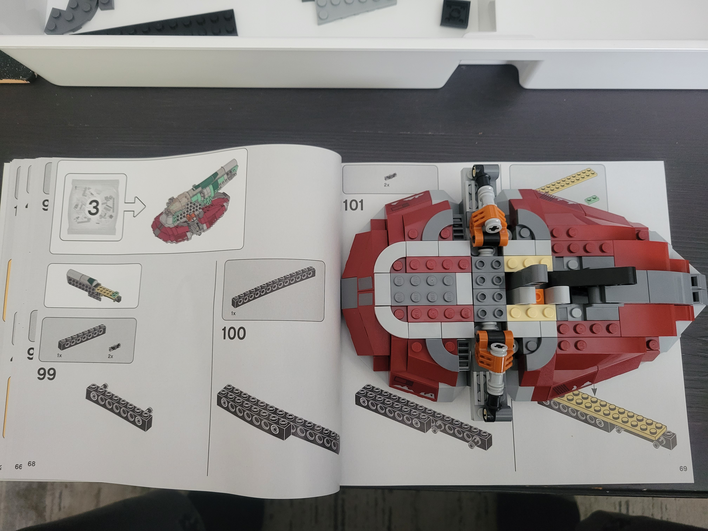
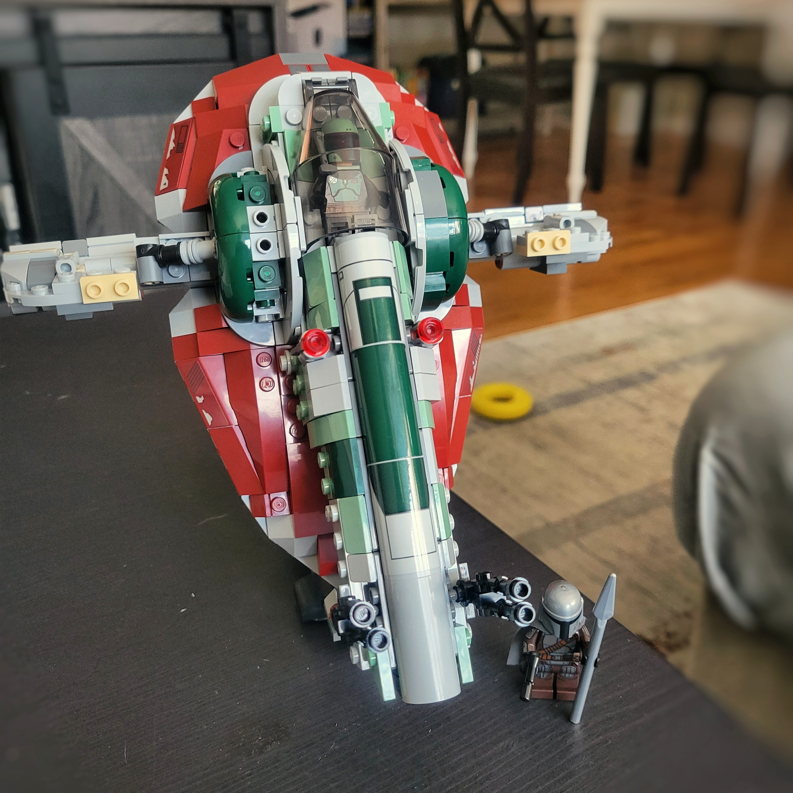

There are *multiple* Slave I sets (I have TWO sets for what I believe is [set #7144](https://rebrickable.com/sets/7144-1/slave-i/?inventory=1#comments)) but this one specifically is for *The Book of Boba Fett*. It is [LEGO set #75312](https://rebrickable.com/sets/75312-1/boba-fetts-starship/#comments), and comes with both aged Boba Fett and The Mandalorian. Officially it is called "Boba Fett's Starship".

### Progress

**Started**: approx. January 8 2022  \
**Completed**: January 10 2022

### Pictures 

*Build progress from January 8 2022*

*Build progress from January 9 2022*

*Completed construction of Boba Fett's Starship January 10 2022*
