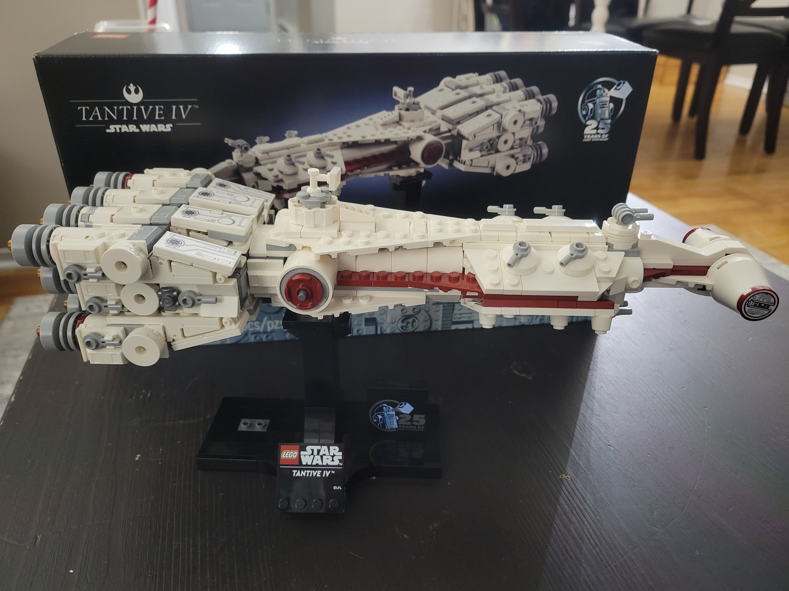
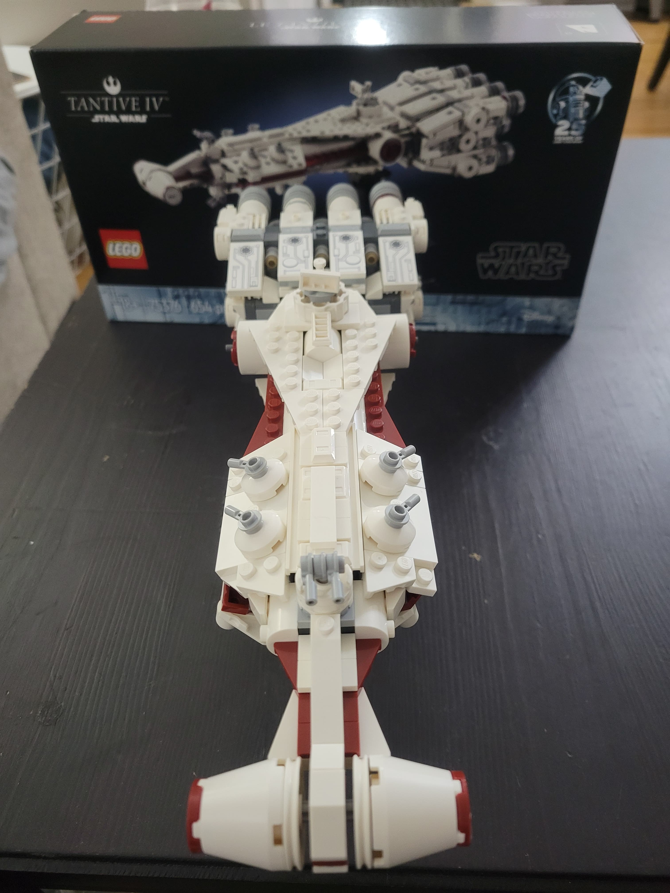

A Christmas gift from 2024, finally completed in 2026. This LEGO model ([#75376](https://www.lego.com/en-ca/product/tantive-iv-75376)) of the Tantive IV from *Star Wars Episode IV: A New Hope* was smaller than expected but looks really great. The instruction booklet has some fun facts about the model and the ship itself (in *Star Wars* lore).  

### Progress 

**Started**: 2026-01-05  \
**Number of sessions**: 2  \
**Completed**: 2026-01-12. \
**Repair**: 2026-03-05

*The ship was knocked down from construction workers handing outside.*
### Pictures

*Initial progress January 5 2026 (bags 1-2)*

*Completed set January 12 2026 (bags 3-7)*

*Another view of the completed set January 12 2026*

